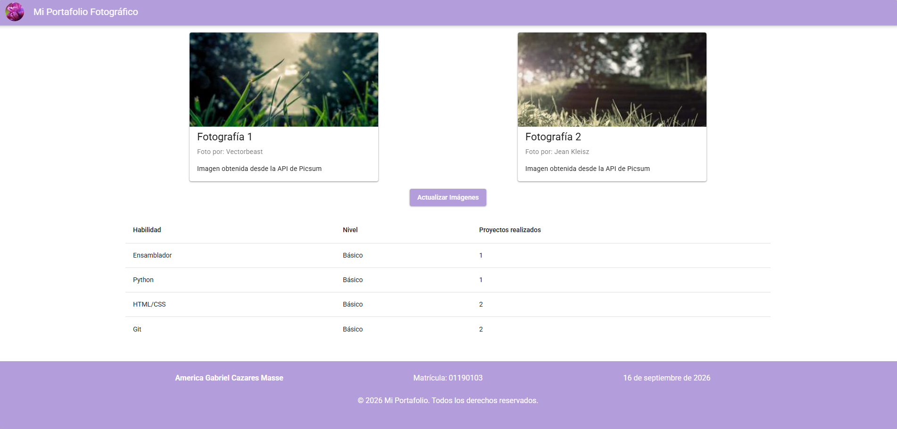

# Meta 2.1 - Desarrollo de Aplicaciones Web - Mi portafolio fotográfico

Aplicación web desarrollada como parte de la Meta 2.1 de la materia **Desarrollo de Aplicaciones Web (DAW)**.

Es un portafolio de fotografías que consume la **API pública de [Lorem Picsum](https://picsum.photos/)** para mostrar imágenes aleatorias en tarjetas, permite actualizarlas con un botón, y muestra además una tabla con las habilidades técnicas, todos los componentes uando Vue y Vuetify.

## Captura de pantalla



Se puede apreciar en la anterior captura que se puede visualizr la estructua completa de la app (encabezado, tarjetas de fotos, el boton de actualizacion, la tabla de habilidades, y el pie de pagina solicitado)

## Instrucciones de instalación y ejecución

### Requisitos previos

- [Node.js](https://nodejs.org/) 20 o superior
- npm (se instala junto con Node.js)

### Pasos

1. Clona el repositorio:

   ```bash
   git clone https://github.com/AmericaGabrielCazaresMasse/Meta_2.1_DAW.git
   ```

2. Entra a la carpeta del proyecto:

   ```bash
   cd Meta_2.1_DAW/meta2.1
   ```

3. Instala las dependencias:

   ```bash
   npm install
   ```

4. Levanta el servidor de desarrollo:

   ```bash
   npm run dev
   ```

5. Abre en el navegador la URL que indique la terminal (por defecto `http://localhost:3000`).

## Tecnologías utilizadas

- **[Vue 3](https://vuejs.org/)** — framework de JavaScript, con `<script setup>` y Composition API
- **[Vite](https://vitejs.dev/)** — bundler y servidor de desarrollo
- **[Vuetify](https://vuetifyjs.com/)** — librería de componentes visuales (Material Design)
- **[Vue Router](https://router.vuejs.org/)** — enrutamiento (generado automáticamente a partir de `src/pages`)
- **TypeScript** — tipado estático en la configuración y archivos base del proyecto
- **[Lorem Picsum API](https://picsum.photos/)** — fuente de las imágenes aleatorias mostradas en las tarjetas
- **ESLint** (`eslint-config-vuetify`) — linting de código
- **Material Design Icons** (`@mdi/font`) y **Roboto** (`@fontsource/roboto`) — tipografía e iconografía

## Estructura del proyecto

```
meta2.1/
├── public/
│   ├── favicon.ico
│   └── layers.css
├── src/
│   ├── assets/
│   │   └── logo.png
│   ├── components/
│   │   ├── AppHeader.vue        # Barra superior con el título del portafolio
│   │   ├── AppFooter.vue        # Pie de página con datos del autor
│   │   ├── TarjetaConImagen.vue # Tarjeta reutilizable para mostrar una foto
│   │   └── TablaDeDatos.vue     # Tabla de habilidades técnicas
│   │   
│   ├── pages/
│   │   └── index.vue            # Página raíz (ruteo automático por archivos)
│   ├── plugins/
│   │   └── vuetify.ts           # Configuración de Vuetify
│   ├── router/
│   │   └── index.ts             # Configuración de Vue Router
│   ├── styles/
│   │   └── settings.scss
│   ├── App.vue                  # Componente raíz: arma las tarjetas, el botón y la tabla
│   └── main.ts                  # Punto de entrada de la aplicación
├── index.html
├── package.json
├── vite.config.mts
└── tsconfig*.json
```

### Componentes principales
- **`App.vue`**: componente raíz de la aplicación. Renderiza `AppHeader`, `AppFooter` y `<router-view />` en medio, que es donde el router inserta la página actual.
- **`pages/index.vue`**: página principal del portafolio. Obtiene dos imágenes aleatorias de la API de Picsum, las guarda en dos tarjetas, controla el estado de carga/error al actualizarlas y arma la tabla de habilidades.
- **`TarjetaConImagen.vue`**: componente reutilizable que recibe `imageUrl`, `title`, `description` y `author` como props, y muestra una barra de progreso circular mientras la imagen carga.
- **`TablaDeDatos.vue`**: tabla estática con las habilidades técnicas del autor.
- **`AppHeader.vue`** / **`AppFooter.vue`**: encabezado y pie de página del portafolio, visibles en `App.vue`.

## Autor

**America Gabriel Cazares Masse**
Matrícula: 01190103